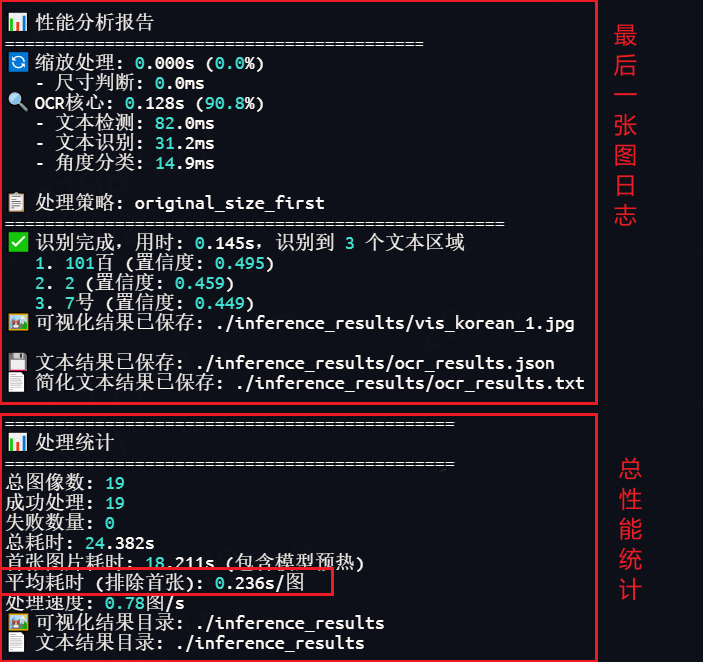
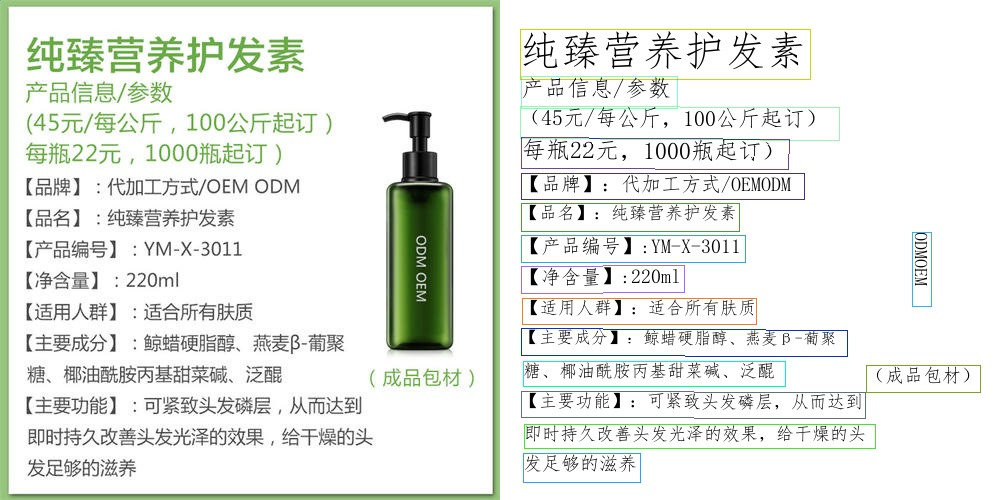

# PaddleOCR-NPU

[](https://www.hiascend.com/) [](https://github.com/PaddlePaddle/PaddleOCR) [](LICENSE)

## 🚀 项目简介

>本项目是基于原版 [PaddleOCR2Pytorch](https://github.com/frotms/PaddleOCR2Pytorch) 的**昇腾(Ascend)NPU**增强版本

**PaddleOCR-NPU** 是专为华为 **昇腾(Ascend)NPU** 优化的高性能OCR文字识别引擎，基于 [PaddleOCR2Pytorch](https://github.com/frotms/PaddleOCR2Pytorch) 深度优化。本项目提供企业级OCR解决方案，适用于文档识别、票据识别、证件识别、表格识别等生产环境应用，实现`PaddleOCR`模型在`NPU`下的高性能部署。

**⭐ 如果这个项目对你有帮助，请给个Star支持一下~**


### 🎯 核心优势

- **🚀 昇腾NPU原生支持** - 完整适配华为昇腾NPU，充分发挥硬件性能
- **⚡ 极速OCR推理** - 单页文字识别 0.3~0.5 秒，同时满足高并发需求
- **🏭 企业级部署** - 已验证稳定性，支持7x24小时连续运行
- **📈 性能卓越** - 相比`PaddleOCR`在`NPU`上提升300%+推理速度

### 🔥 新增功能
- **🎯 华为昇腾NPU适配** - 完整支持昇腾NPU硬件加速，显著提升推理性能
- **🌐 企业级API服务** - FastAPI框架，RESTful接口，支持生产环境部署
- **📸 智能图像预处理** - 自动图片压缩优化，内存使用优化
- **⚡ 批量OCR优化** - 模型级批处理优化，多图处理速度提升40%，单图提升30%
- **📊 性能监控分析** - 内置推理性能分析，OCR识别监控功能
- **🛠️ 开发者工具** - 提供命令行工具和快速启动脚本

## 🚀 快速开始

### 环境要求
```bash
Python 3.10
PyTorch 2.1.0
```

### 安装依赖
```bash
pip install -r requirements.txt

# 下载PyTorch安装包
wget https://download.pytorch.org/whl/cpu/torch-2.1.0-cp310-cp310-manylinux_2_17_aarch64.manylinux2014_aarch64.whl
# 下载torch_npu插件包
wget https://gitee.com/ascend/pytorch/releases/download/v6.0.0-pytorch2.1.0/torch_npu-2.1.0.post10-cp310-cp310-manylinux_2_17_aarch64.manylinux2014_aarch64.whl
# 安装命令
pip3 install torch-2.1.0-cp310-cp310-manylinux_2_17_aarch64.manylinux2014_aarch64.whl
pip3 install torch_npu-2.1.0.post10-cp310-cp310-manylinux_2_17_aarch64.manylinux2014_aarch64.whl
```


### 模型下载
> 由`PaddleOCR2Pytorch`作者维护：
> PyTorch模型下载链接：https://pan.baidu.com/s/1r1DELT8BlgxeOP2RqREJEg 提取码：6clx

以下推理样例使用模型：`ptocr_v5_server_det.pth`、`ptocr_v5_server_rec.pth`、`ch_ptocr_mobile_v2.0_cls_infer.pth`。

请下载并将其放入`models`文件夹下。

### 启动服务

```bash
# 基础启动（默认端口8011，所有参数使用默认值）
python start_server.py

# 自定义端口和地址
python start_server.py --port 8012

# 禁用方向分类模型（提升速度，减少显存）
python start_server.py --disable_angle_cls
```

### 快速验证脚本

```bash
# 单图识别 (默认NPU加速)
python quick_ocr.py --image_dir ./test_image.jpg

# 批量处理 (默认NPU加速)
python quick_ocr.py --image_dir ./images_folder/
```

其他方式：[模型预测](./doc/inference.md)

### 效果展示

**处理日志示例**


**可视化结果示例**


## 🌐 API接口

### 服务信息
- **默认地址**: `http://localhost:8011`
- **API文档**: `http://localhost:8011/docs`
- **支持格式**: JPG, JPEG, PNG

### **请求示例**

**curl示例**:

```bash
curl --request POST \
  --url http://localhost:8011/ocr/upload \
  --header 'Accept: */*' \
  --header 'Accept-Encoding: gzip, deflate, br' \
  --header 'Connection: keep-alive' \
  --header 'User-Agent: PostmanRuntime-ApipostRuntime/1.1.0' \
  --header 'content-type: multipart/form-data' \
  --form 'file=@/path/to/your/document.jpg'
```

**Python示例**:
```python
import requests
import base64

with open("image.jpg", "rb") as f:
    image_data = base64.b64encode(f.read()).decode()

response = requests.post("http://localhost:8011/ocr/single", json={
    "image": image_data
})

result = response.json()
print(result["result"]["markdown_result"])
```


## 📋 完整参数说明

### 🌐 服务配置参数
| 参数 | 类型 | 默认值 | 说明 |
|------|------|--------|------|
| `--host` | string | `0.0.0.0` | 服务绑定地址，`0.0.0.0`允许外部访问，`127.0.0.1`仅本地访问 |
| `--port` | int | `8011` | 服务端口号 |

### 🎯 OCR基础配置参数
| 参数 | 类型 | 默认值 | 说明 |
|------|------|--------|------|
| `--disable_angle_cls` | flag | `false` | 禁用文本方向分类模型，可提升推理速度10-15% |
| `--npu_device_id` | int | `0` | NPU设备ID，多卡时指定使用的NPU |
| `--drop_score` | float | `0.5` | 置信度过滤阈值，低于此值的文本将被过滤 |

### 📁 模型路径配置参数
| 参数 | 类型 | 默认值 | 说明 |
|------|------|--------|------|
| `--det_model_path` | string | `./models/ptocr_v5_server_det.pth` | 检测模型文件路径 |
| `--rec_model_path` | string | `./models/ptocr_v5_server_rec.pth` | 识别模型文件路径 |
| `--cls_model_path` | string | `./models/ch_ptocr_mobile_v2.0_cls_infer.pth` | 分类模型文件路径 |
| `--rec_char_dict_path` | string | `./pytorchocr/utils/dict/ppocrv5_dict.txt` | 识别字典文件路径 |

| 参数 | 类型 | 默认值 | 说明 |
|------|------|--------|------|
| `--det_yaml_path` | string | `configs/det/PP-OCRv5/PP-OCRv5_server_det.yml` | 检测模型配置文件路径 |
| `--rec_yaml_path` | string | `configs/rec/PP-OCRv5/PP-OCRv5_server_rec.yml` | 识别模型配置文件路径 |

### 🔍 模型参数
| 参数 | 类型 | 默认值 | 说明 |
|------|------|--------|------|
| `--det_db_thresh` | float | `0.12` | 检测阈值，越小检测越敏感，能识别更多文本 |
| `--det_db_box_thresh` | float | `0.15` | 边界框阈值，影响文本框的精确度 |
| `--det_limit_side_len` | int | `960` | 检测图像边长限制，影响处理速度和精度平衡 |
| `--det_db_unclip_ratio` | float | `1.8` | 文本框扩展比例，影响文本框的大小 |

| 参数 | 类型 | 默认值 | 说明 |
|------|------|--------|------|
| `--max_text_length` | int | `25` | 最大文本长度限制 |
| `--use_space_char` | flag | `true` | 是否使用空格字符进行识别 |

| 参数 | 类型 | 默认值 | 说明 |
|------|------|--------|------|
| `--cls_thresh` | float | `0.9` | 分类置信度阈值，影响文本方向判断的准确性 |

参数较多，其他参数可参考Paddle官方文档。

### ⚡ 性能优化参数

| 参数 | 类型 | 默认值 | 说明 |
|------|------|--------|------|
| `--cls_batch_num` | int | `24` | 分类批处理大小，影响方向分类的处理速度 |
| `--rec_batch_num` | int | `12` | 识别批处理大小，影响文本识别的处理速度 |

### 📐 压缩处理参数
| 参数 | 类型 | 默认值 | 说明 |
|------|------|--------|------|
| `--original_size_threshold` | int | `4000000` | 原始图像处理阈值（像素），超过此值将启用智能缩放 |
| `--max_progressive_attempts` | int | `5` | 渐进式缩放最大尝试次数，影响大图像的处理策略 |

## 🤝 贡献

欢迎提交Issue和Pull Request来改进项目！

## 📄 许可证

本项目基于原版PaddleOCR2Pytorch，遵循相同的开源许可证。

## 🙏 致谢

- [PaddleOCR](https://github.com/PaddlePaddle/PaddleOCR) - 提供高质量的OCR模型
- [PaddleOCR2Pytorch](https://github.com/frotms/PaddleOCR2Pytorch) - 提供Pytorch推理的途径
- [PyTorch](https://pytorch.org/) - 深度学习框架
- 华为昇腾 - NPU计算支持

**⭐ 如果这个项目对你有帮助，请给个Star支持一下！**
